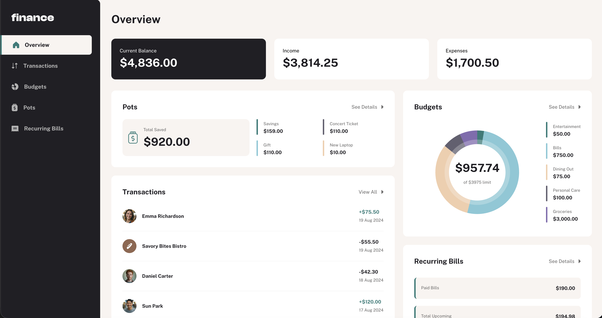

# Frontend Mentor - Personal finance app solution

This is a solution to the [Personal finance app challenge on Frontend Mentor](https://www.frontendmentor.io/challenges/personal-finance-app-JfjtZgyMt1). Frontend Mentor challenges help you improve your coding skills by building realistic projects. 

## Table of contents

- [Overview](#overview)
  - [The challenge](#the-challenge)
  - [Screenshot](#screenshot)
  - [Links](#links)
- [My process](#my-process)
  - [Built with](#built-with)
  - [What I learned](#what-i-learned)
  - [Continued development](#continued-development)
  - [Useful resources](#useful-resources)
- [Author](#author)

## Overview

### The challenge

Users should be able to:

- See all of the personal finance app data at-a-glance on the overview page
- View all transactions on the transactions page with pagination for every ten transactions
- Search, sort, and filter transactions
- Create, read, update, delete (CRUD) budgets and saving pots
- View the latest three transactions for each budget category created
- View progress towards each pot
- Add money to and withdraw money from pots
- View recurring bills and the status of each for the current month
- Search and sort recurring bills
- Receive validation messages if required form fields aren't completed
- Navigate the whole app and perform all actions using only their keyboard
- View the optimal layout for the interface depending on their device's screen size
- See hover and focus states for all interactive elements on the page

### Screenshot

### Links

- Solution URL: [https://github.com/alsheha88/personal-finance-app-2]
- Live Site URL: [https://alsheha88.github.io/personal-finance-app-2/]

## My process

### Built with

- Semantic HTML5 markup
- CSS custom properties
- Flexbox
- CSS Grid
- Vanilla JavaScript

### What I learned

This project was the most difficult project i worked on. However, it was the one i learned from the most. The things that i have learned are as follows: 

- SVG manipulation.
- State Management.
- localStorage.
- Multipage control.
- Project structure optimization.
- CSS utility classes and design systems. and many more....

### Continued development

I would need to focus more on localStorage functionality and code optimization as i feel my code is a lengthy and requires further optimization. I will be working on refractoring my code and also jump into developing a login page and making this project as a full stack project

## Author

- Website - [Abdulaziz AlSheeha](https://alsheha88.github.io/)
- Frontend Mentor - [@alsheha88](https://www.frontendmentor.io/profile/alsheha88)

